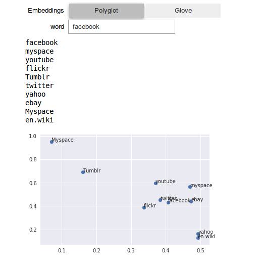
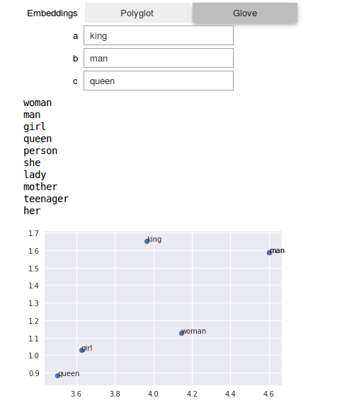

# intro-word-embeddings

A notebook to demonstrate common tricks with word embeddings. Meant to accompany [a talk](https://gtagency.github.io/2018/nlp-fundamentals)
I gave to [Agency](https://gtagency.github.io/).

## Running

Best run using [Anaconda python3](https://www.anaconda.com/download/).
This notebook also requires [PyTorch](https://pytorch.org/) and [torchtext](https://github.com/pytorch/text).

I'm a big fan of [Jupyter Widgets](https://ipywidgets.readthedocs.io/en/stable/examples/Widget%20Basics.html),
which let you add interactive components to a standard Jupyter notebook very easily.

## Embeddings
I used torchtext's built in support for [GloVe](https://nlp.stanford.edu/projects/glove/) vectors.
As an additional point of comparison, I used [Polyglot vectors](https://sites.google.com/site/rmyeid/projects/polyglot).
These were preprocessed to match the .txt format expected by the torchtext vector loader.
The GloVe vectors will be downloaded by the vector loader, but the Polyglot vectors are much smaller so I
include the processed file. *Note:* The GloVe embeddings are ~800mb, so it might take a while to download and load.
You'll likely get better analogy performance if you experiment with other versions of the GloVe embeddings.

## Examples
Word embeddings often form clusters composed of semantically similar words. Below are the nearest vectors to the vector for `facebook` in the Polyglot embeddings. Nearness is defined by [cosine similarity](https://en.wikipedia.org/wiki/Cosine_similarity),
but this can be changed to euclidean distance in the notebook. I also use PCA to reduce the dimensionality of the embedding space and plot the nearby points.

Word embeddings also tend to have the nice property that vector addition does "semantic addition". The classic example is using embeddings to solve analogies, as shown here using GloVe:

The analogy here is `king is to man as queen is to ____ `.
Again, the printed results are the nearest vectors and the plot is created using PCA.
